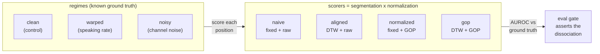

# VoxTutor

[](https://voxtutor.dexdevs.com)

> **▶ Live demo: [voxtutor.dexdevs.com](https://voxtutor.dexdevs.com)** — run it in your browser, free offline backend. Browse all 10 portfolio demos via the *all demos* link.

[](https://github.com/ranafaraz/VoxTutor/actions/workflows/ci.yml)
[](https://github.com/ranafaraz/VoxTutor)
[](LICENSE)

**A pronunciation-assessment benchmark for spoken-language tutoring.** VoxTutor synthesizes
learner utterances from a known phoneme inventory with mispronunciations injected at *known
positions*, then scores pronunciation scorers on whether they recover them. The result is a
clean 2×2 dissociation: **forced alignment and Goodness-of-Pronunciation normalization each
buy robustness to a different real-world distortion, and you need both** — speaking-rate
variation breaks naive segmentation, channel noise breaks raw distance, and a control regime
proves each failure comes from the missing ingredient, not the scorer in general.

> Why it matters: a computer-assisted pronunciation tutor has to tell a genuine
> mispronunciation apart from a learner who simply spoke fast or recorded on a noisy mic.
> VoxTutor turns that folklore into a measured, reproducible result against a known answer —
> no acoustic model to train, no labelled speech corpus, no API keys.

## Demo


```console
$ voxtutor compare --regime warped     # speaking-rate variation
scorer         ingredients         auroc
------------------------------------------
random         baseline           0.4731
naive          fixed+raw          0.6163
aligned        align+raw          1.0000   # forced alignment is unaffected
normalized     fixed+gop-norm     0.6486
gop            align+gop-norm     1.0000

$ voxtutor compare --regime noisy      # heteroscedastic channel noise
naive          fixed+raw          0.7936
aligned        align+raw          0.7932   # raw distance now collapses too
normalized     fixed+gop-norm     0.9988   # GOP normalization is unaffected
gop            align+gop-norm     0.9987
```

## How it works

Each utterance is a sequence of canonical phonemes rendered as acoustic feature frames around
per-phoneme templates. A subset of positions is **mispronounced** (the template is nudged by a
small, confusable amount). A scorer must flag those positions. It is built from two independent
ingredients, giving a 2×2:



- **segmentation** — `fixed` splits the frames into equal chunks (correct only at constant
  speaking rate); **`DTW`** forced alignment re-segments the frames against the canonical
  sequence, so it survives rate variation.
- **normalization** — `raw` is the mean frame-to-template distance; by the bias–variance
  identity that equals the real error **plus** the within-phone variance, so channel noise
  inflates it. **`GOP`** scores the distance of the position's *centroid* to the template,
  subtracting the variance — a likelihood-ratio / Goodness-of-Pronunciation style correction.

## Results

Mean AUROC over 12 seeds, 40 utterances/cell, against the known mispronunciations
(1.0 = perfect, 0.5 = chance). Reproduce with `python -m evals.harness`.

| scorer | ingredients | clean (control) | warped | noisy |
|---|---|--:|--:|--:|
| random | baseline | 0.491 | 0.509 | 0.508 |
| naive | fixed + raw | 1.000 | **0.620** ⤵ | **0.730** ⤵ |
| aligned | align + raw | 1.000 | 1.000 | **0.728** ⤵ |
| normalized | fixed + gop-norm | 1.000 | **0.662** ⤵ | 0.999 |
| **gop** | **align + gop-norm** | **1.000** | **1.000** | **0.999** |

- **Effect 1 — forced alignment beats speaking-rate variation.** The fixed-segmentation
  scorers drop on `warped` (`naive` `1.000 → 0.620`, `normalized` `1.000 → 0.662`); the
  forced-alignment scorers stay `1.000`.
- **Effect 2 — GOP normalization beats channel noise.** The raw scorers drop on `noisy`
  (`naive` `1.000 → 0.730`, `aligned` `1.000 → 0.728`); the normalized scorers stay `~1.0`.
- **Each ablation fails only its own regime**, and `naive` (neither ingredient) fails on both —
  so only `gop` is robust everywhere. The collapse is the missing ingredient, not the scorer.
- **Scrambled-label null:** shuffle the ground truth and every scorer falls to ~0.50,
  confirming the AUROC is real (full table in [`evals/RESULTS.md`](evals/RESULTS.md)).

## Quickstart

```bash
pip install -e ".[dev]"          # numpy only; no API keys, no downloads

voxtutor compare --regime warped     # all scorers on one regime
voxtutor compare --regime noisy
voxtutor score --method gop --regime noisy
voxtutor regimes                     # describe the distortion regimes

python -m evals.harness          # write evals/RESULTS.md
python -m evals.gate             # assert the dissociation (CI gate)
pytest -q                        # 56 tests
```

Configure via env vars (see [`.env.example`](.env.example)): `VOXTUTOR_METHOD`,
`VOXTUTOR_REGIME`, `VOXTUTOR_LABELS`, `VOXTUTOR_SAMPLES`, `VOXTUTOR_SEED`.

### Docker

```bash
docker build -t voxtutor .
docker run --rm voxtutor          # runs the full offline benchmark
```

### Optional: SciPy cross-check

```bash
pip install -e ".[scipy]"         # then the skipped tests run
```

Recomputes the DTW frame-template cost matrix with `scipy.spatial.distance.cdist` and the
AUROC with `scipy.stats.mannwhitneyu`, and asserts both match the hand-rolled numpy core.

## Design notes

- **Offline & deterministic.** numpy is the only runtime dependency; every number is produced
  from `np.random.default_rng` with a fixed salt, so CI reproduces the table bit-for-bit across
  Python 3.10–3.12.
- **Synthesized, not recorded.** Utterances are generated from a known phoneme inventory with
  mispronunciations injected at known positions — the ground truth is exact, no speech corpus
  and no "is this label right?" ambiguity.
- **The experiment is tuned, never the scorer.** Distortion strengths are chosen to make the
  failure visible; the scorers are textbook (uniform segmentation, DTW forced alignment, GOP).

See [`docs/ARCHITECTURE.md`](docs/ARCHITECTURE.md) and [`docs/DECISIONS.md`](docs/DECISIONS.md)
for the full design.

## License

MIT — see [LICENSE](LICENSE).
